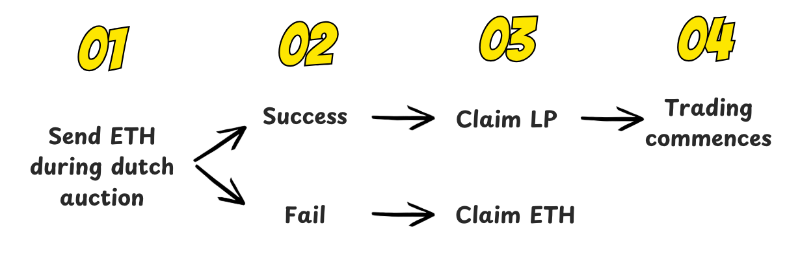
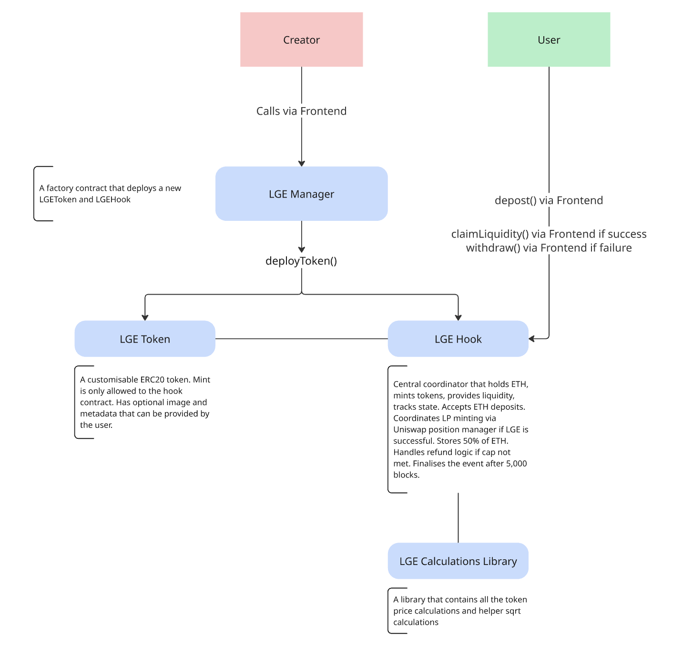

# LGE Hookathon Entry HK-UHI6-0442 - UHI6
**No partner integrations**

This repository contains smart contracts for the LGE (Liquidity Generation Event) - a novel liquidity-first mechanism for launching new tokens on Uniswap v4. Creators bootstrap liquidity with a dutch auction. Only if 100% liquidity is achieved is the LGE a success, otherwise participants claim their ETH back loosing nothing.
## LGE Flow

## Architecture

### Core Components
1. **LGEManager.sol** - Factory Contract.
The main entry point for deploying new LGE campaigns.
*Key Features:*
	- Deploys an ERC20 token;
	- Deploys a hook along with the token;
2. **LGEToken.sol** - ERC20 Token.
A capped ERC20 token with administrative functions.
*Key Features:*
	- Fixed total supply - 17,745,440,000 tokens, 18 decimals;
	- Burnable tokens;
	- Capped total supply;
	- Admin-controlled metadata and image updates;
	- Minting restricted to the LGE hook only;
3. **LGEHook.sol** - Uniswap v4 Hook.
The core LGE mechanism that handles deposits, liquidity provision, and pool creation.
*Key Features:*
	- LGE duration: 5,000 blocks;
	- deposit() function: users deposit ETH to purchase tokens at the calculated price;
	- withdraw() function: retrieve ETH if LGE fails;
	- claimLiquidity() function: claim LP position after successful LGE;
4. **LGECalculationsLibrary.sol** - Price Calculations.
Helper library for price and liquidity calculations.
*Key Features:*
	- Calculates token price based on min/max values, current block, and a start block;
	- Calculates sqrt for the pool initialisation;
### LGE Mechanism
#### Phase 1: Token Sale (Blocks 0-5,000)
1.  **Dynamic Pricing**: Token price decreases linearly from `maxTokenPrice` to `minTokenPrice` over the stream period
2.  **Deposit Structure**: Users deposit ETH where:
    -   50% goes toward liquidity provision
    -   50% remains for rewards and tokenomics
3.  **Fair Distribution**: Dutch auction prevents sniping, ensures early buyers don't have unfair advantage and allows price discover.
#### Phase 2: LGE Conclusion (Block 5,000)
**Success Criteria**: All tokens (cap amount) must be sold.

If successful:
-   Uniswap v4 pool is automatically created
-   Initial liquidity is added (50% of ETH + all tokens)
-   Pool parameters (may change for MVP based on feedback and more testing):
    -   Fee: 1% (10,000 basis points)
    -   Tick spacing: 1
    -   Full range liquidity (MIN_TICK to MAX_TICK)

If failed:
-   Users can withdraw their deposited ETH

## Open Issues
The current open issue is the precision loss that happens during minting a position. It uses exact half of the ETH needed to mint a liquidity, however it also uses smaller amount of tokens. Ideally, what we want to achieve is using exact amount of ETH + exact amount of tokens to create a liquidity position. We're currently investigating the best way to achieve this with minimal precision loss.
## Test Coverage
Current test coverage is ~80%. The main tests are located in the `test` directory, `LGEHook.t.sol`. The tests cover various scenarios, including successful and failed LGEs.
## Contract Deployments
**Ethereum Sepolia Testnet (not verified)**
| Contract Name | Contract Address |
|--|--|
| LGEManager | 0x80b151Bd4Ed017692F395E2F0395f0c84071A56B |
| LGECalculationsLibrary | 0x74C6B2321BeD36FB92E9c88fc33D2A77ED7bBe57 |

**Arc Testnet (chain ID 5042002, verified on Blockscout) — built with via_ir + optimizer (LGEManager exceeds the 24KB limit unoptimized)**
| Contract Name | Contract Address |
|--|--|
| LGEManager | [0x0aa1421add6b810a0d99541fb13501948bdcdb7a](https://explorer.testnet.arc.io/address/0x0aa1421add6b810a0d99541fb13501948bdcdb7a) |
| LGECalculationsLibrary | [0x23f7ab13a4aBc7670E40B663872f2A976bF3ea96](https://explorer.testnet.arc.io/address/0x23f7ab13a4aBc7670E40B663872f2A976bF3ea96) |
| HookMinerWrapper | [0x9787190430d32c70c2787af01353a6193cf8ef51](https://explorer.testnet.arc.io/address/0x9787190430d32c70c2787af01353a6193cf8ef51) |

Verification note: the on-chain builds were compiled by solc 0.8.28 (foundry
auto-detect at deploy time), while a fresh local build today resolves 0.8.26 —
`forge verify-contract` with default settings will mismatch. Verify via the
Blockscout v2 standard-input endpoint with `v0.8.28+commit.7893614a`; the
library was deployed without via_ir/optimizer, LGEManager with via_ir +
optimizer (200 runs) + the library link. `BLOCKSCOUT_API_KEY` goes in `.env`
(see foundry.toml `[etherscan]`).

Arc v4 infrastructure (official Uniswap deployment, same addresses as Arc mainnet):
PoolManager `0x8366a39CC670B4001A1121B8F6A443A643e40951`,
PositionManager `0x6049c9a0e26405C0985f9E3685C87d0aE917f82B`,
Permit2 `0x000000000022D473030F116dDEE9F6B43aC78BA3`.
## License
MIT

